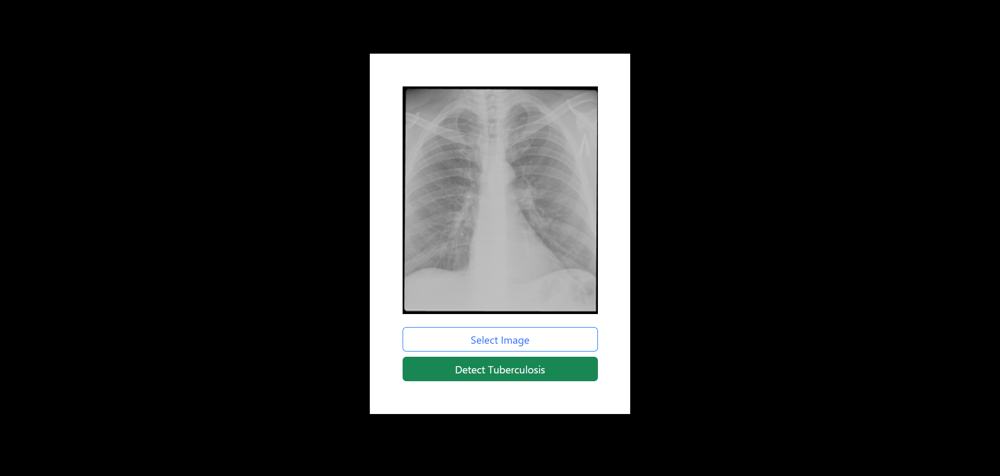

# Tuberculosis X-Ray Classification App

This project is a React application built with Vite that utilizes machine learning to classify tuberculosis (TB) X-ray images into two categories: TB present and TB absent. 



## Features

- **Image Classification**: The app employs a machine learning model to classify tuberculosis X-ray images accurately.
- **User-Friendly Interface**: The React-based interface ensures a seamless user experience.
- **Fast Loading**: Built with Vite, the application loads swiftly, providing quick responses to user interactions.

## Prerequisites

Before running the application, ensure you have the following installed:

- Node.js and npm: You can download and install Node.js from [nodejs.org](https://nodejs.org/).
- Git: Install Git from [git-scm.com](https://git-scm.com/) if not already installed.

## Setup

1. **Clone the Repository**: 
    ```bash
    git clone https://github.com/misingo255/react-tuberculosis-xray-classification-app.git
    ```

2. **Navigate to the Project Directory**:
    ```bash
    cd react-tuberculosis-xray-classification-app
    ```

3. **Install Dependencies**:
    ```bash
    npm install
    ```

4. **Run the Application**:
    ```bash
    npm run dev
    ```

5. **Access the Application**:
   Open your browser and go to `http://localhost:3000` to view and interact with the application.

## Usage

1. **Upload an Image**: Click on the "Choose File" button to select an X-ray image of the chest from your device.

2. **Classify Image**: Once the image is uploaded, click on the "Classify" button to initiate the classification process.

3. **View Results**: The app will display the classification results indicating whether the uploaded X-ray image shows the presence or absence of tuberculosis.

4. **Try Another Image**: You can repeat the process by uploading another X-ray image for classification.

## Contributing

Contributions are welcome! If you find any issues or have suggestions for improvements, feel free to open an issue or create a pull request on the GitHub repository.

## License

This project is licensed under the [MIT License](LICENSE).

## Acknowledgments

Special thanks to the developers and contributors of the machine learning models used in this project, as well as the React and Vite communities for their valuable resources and support.
